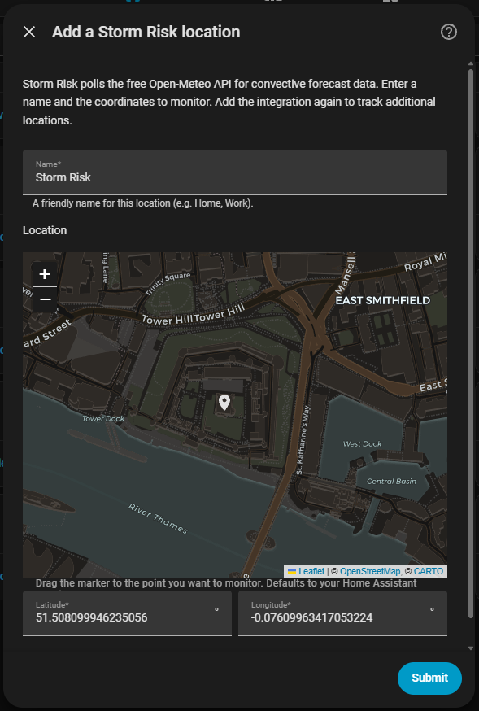
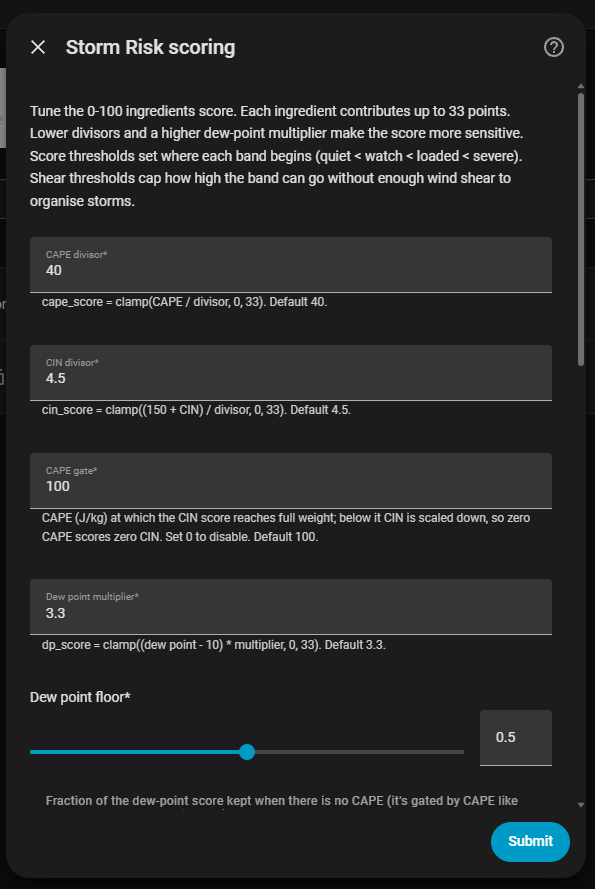

# Storm Risk — Home Assistant integration

[](https://github.com/hacs/integration)
[](https://github.com/JRyall/Ha-storm-risk/actions/workflows/validate.yaml)
[](LICENSE)

A Home Assistant custom integration that surfaces **convective storm forecasting
data** from the free [Open-Meteo](https://open-meteo.com/) API and distils it
into a handful of sensors — including a composite **Storm Risk** score — so you
can watch thunderstorm potential build over the day.

It's aimed at amateur meteorology enthusiasts, storm chasers, and anyone who
likes knowing *why* the air feels like it might do something interesting later.
The goal is to help you understand the ingredients, not just read a number.

> ⚠️ **This is a model forecast, not a nowcast or a warning service.** It is for
> curiosity and education. Do **not** use it for safety-critical decisions. See
> [Limitations](#limitations).

---

## What it does

Convective storms need a few ingredients to come together: instability (energy
for air to rise), a lack of a "lid" holding that energy down, and enough
low-level moisture to feed developing clouds. This integration polls Open-Meteo
for the relevant parameters and exposes them as sensors, then combines three of
them into a single 0–100 score.

### Sensors

| Sensor | Unit | Meaning |
| --- | --- | --- |
| **CAPE now** | J/kg | Convective Available Potential Energy for the current hour — the "fuel" available to rising air. |
| **CIN now** | J/kg | Convective Inhibition for the current hour — the strength of the "lid" suppressing storms (zero or negative). |
| **CAPE max today** | J/kg | The highest CAPE in the next 24 hours. |
| **CAPE peak hour today** | `HH:MM` | The local time at which CAPE is forecast to peak. |
| **Temperature** | °C | Current 2 m air temperature. |
| **Dew point** | °C | Current 2 m dew point — a direct measure of low-level moisture. |
| **CAPE max (7 day)** | J/kg | Highest CAPE anywhere in the next 7 days; per-day breakdown in attributes. |
| **Wind shear** | m/s | Deep-layer (10 m → 500 hPa) bulk shear — how *organised* storms can get. A `mode` attribute classifies it (pulse / organised / supercell). |
| **Trigger likelihood** | % | Precipitation probability for the current hour — a "will anything actually fire" cross-check. **Not** part of the score. |
| **Storm risk outlook (7 day)** | _score_ | Highest **storm-risk score** over the next 7 days; per-day breakdown in attributes. |
| **Storm risk** | _score_ | Composite **0–100 ingredients score** from CAPE, CIN, and dew point (see below). Unitless — how loaded the atmosphere is, not a probability. |

There's also a **Storm risk active** `binary_sensor` that turns on once the
score crosses the configurable *active threshold* (default 45) — handy as an
automation condition or in the logbook — and a **Roaming** `switch` (see
[Roaming mode](#roaming-mode)).

The **Storm risk** sensor exposes `cape_score`, `cin_score`, `dp_score` and
`level` so you can see how the score was built, plus `shear`, `mode`, `trigger`,
`peak_score`/`peak_time` (the next-24h peak), the firing-likelihood classifiers
`cape_magnitude` / `cin_trend` / `cap_state` (see
[Reading the firing likelihood](#reading-the-firing-likelihood)), and a
`forecast` attribute: the next 24 hours as a list of
`{datetime, cape, cin, storm_risk}` for graphing (see
[Forecast graphs](#forecast-graphs-apexcharts)).

The **CAPE now** and **CIN now** sensors also carry these as their own
attributes: `magnitude` on CAPE, and `trend` / `trend_delta_6h` / `cap_state`
on CIN — handy for templates and automations.

The **CAPE max (7 day)** and **Storm risk outlook (7 day)** sensors expose a
`daily` attribute — a list of `{date, cape_max, cape_peak_hour, storm_risk_max}`,
one entry per day — for a week-ahead outlook.

> **Shear and trigger degrade gracefully.** They rely on optional Open-Meteo
> variables (pressure-level winds and precipitation probability). If your
> chosen model doesn't return them, those sensors read *unknown*, the band cap
> is skipped, and the rest of the integration carries on unaffected.

> **Recorder note:** the `forecast` and `daily` attributes are lists that
> change every poll. If you want to keep your history database lean, exclude
> them from the recorder (you keep the sensor states, just not the big
> attributes):
>
> ```yaml
> recorder:
>   exclude:
>     entity_globs:
>       - sensor.*_storm_risk
>       - sensor.*_cape_max_7_day
> ```

### Reading the numbers — a climatological scale

These are rough rules of thumb for **mid-latitude / UK** conditions. Thresholds
that matter for severe weather are much lower in the UK than in, say, the US
Great Plains.

**CAPE (J/kg)** — instability / fuel:

| Value | Interpretation |
| --- | --- |
| 0–100 | Stable. Nothing convective. |
| 100–500 | Weak instability. Showers possible with a trigger. |
| 500–1000 | Moderate. Thunderstorms plausible in the UK. |
| 1000–2500 | Strong (a big day for the UK). |
| 2500+ | Very strong; common in continental/US setups, rare in the UK. |

**CIN (J/kg)** — the lid (always ≤ 0):

| Value | Interpretation |
| --- | --- |
| 0 to −25 | Weak cap. Storms can fire easily if CAPE is present. |
| −25 to −100 | Moderate cap. Needs a decent trigger to break. |
| < −100 | Strong cap. Storms unlikely unless something forces the lid. |

Note that a *strong* cap can be a loaded gun: it lets CAPE build all afternoon,
then breaks explosively. High CAPE **and** moderate CIN is the classic
"primed" signature.

**Dew point (°C)** — low-level moisture:

| Value | Interpretation |
| --- | --- |
| < 10 | Dry. Limited storm fuel. |
| 10–15 | Modest moisture. |
| 15–18 | Moist; supportive of UK convection. |
| 18+ | Very humid; muggy, thundery feel. |

### The Storm Risk score

The score sums three ingredients, each capped at 33 points (max 99, displayed
as 100):

```text
cape_factor = clamp(cape / 100, 0, 1)            # how much CAPE is present
dp_factor   = 0.5 + 0.5 * cape_factor            # dew point gated, floored at 0.5

cape_score  = clamp(cape / 40,              0, 33)
cin_score   = clamp((150 + cin) / 4.5,      0, 33) * cape_factor
dp_score    = clamp((dew_point - 10) * 3.3, 0, 33) * dp_factor

storm_risk  = round(cape_score + cin_score + dp_score)
```

where `clamp(x, lo, hi) = max(lo, min(hi, x))`.

**Why gate CIN and dew point by CAPE?** Instability (CAPE) is the engine of a
storm; the lid (CIN) and moisture (dew point) only matter if there's CAPE for
them to act on. Without gating, a calm, muggy, dead-stable day would score
highly on moisture and a favourable lid alone — which is meteorological
nonsense.

- **CIN** is gated fully: `cin_score` scales from 0 (no CAPE) to full once CAPE
  reaches the **CAPE gate** (default 100 J/kg). Set the gate to `0` to disable.
- **Dew point** is gated *partially*: it keeps a baseline fraction of its weight
  even at zero CAPE — the **dew point floor** (default `0.5`). This is a
  deliberate hedge: Open-Meteo gives a single (surface/mixed-layer) CAPE value,
  which collapses toward zero overnight even when *elevated* instability could
  still fire storms. The floor keeps a faint moisture signal so muggy low-CAPE
  nights aren't flattened to zero. Set the floor to `1` for the old ungated
  behaviour, or `0` to gate dew point as hard as CIN.

The score is bucketed into five interpretation bands (exposed as the `level`
attribute, shown as a coloured tag on the card):

| Score | `level` | Tag | Interpretation |
| --- | --- | --- | --- |
| 0–24 | `none` | None | Nothing brewing. |
| 25–44 | `quiet` | Quiet | A few ingredients, very unlikely to fire. |
| 45–64 | `watch` | Watch | Worth keeping an eye on. |
| 65–84 | `loaded` | Loaded | Properly loaded setup. |
| 85–100 | `severe` | Severe | All ingredients maxed out. |

### Wind shear caps the band

The score above is pure *thermodynamics* — it measures whether storms **can**
form, not whether they'll be **organised**. That's set by **deep-layer wind
shear**: with too little of it, even a maxed-out airmass only manages
disorganised "pulse" storms. So shear doesn't change the score — it **caps the
band**:

| Bulk shear (10 m → 500 hPa) | Highest band allowed | `mode` |
| --- | --- | --- |
| below `shear_loaded_min` (default 10 m/s) | Watch | `pulse` |
| `shear_loaded_min` … `shear_severe_min` (10–18 m/s) | Loaded | `organised` |
| at/above `shear_severe_min` (default 18 m/s) | Severe (uncapped) | `supercell` |

So a score of 90 with only 6 m/s of shear reports **Watch** (`pulse`), not
Severe — high instability, but nothing to organise it. The score itself still
reads 90, and the card's context line shows *why* (`Pulse storms · shear 6 m/s`).
If the model returns no shear data the cap is skipped.

**Trigger likelihood** (precipitation probability) is reported as its own
sensor and shown on the card, but is deliberately kept **out** of the score:
the score is environment *potential*; whether a trigger arrives is a separate
axis, shown side by side rather than blended in.

The divisors/multiplier, the band thresholds, the shear cutoffs and the active
threshold are all editable in the [options flow](#options).

### Reading the firing likelihood

The score tells you *how loaded* the atmosphere is, but on a big day the CAPE
and CIN bars just peg at 33/33 / look strong without telling you whether
anything will actually go up. Three derived labels fill that gap (on the card:
under the CAPE/CIN bars and in the header context line):

- **`cape_magnitude`** — how maxed the CAPE really is, since the bar saturates
  near 1000 J/kg: `weak` (<500) · `moderate` (<1000) · `significant` (<2000) ·
  `major` (<3000) · `extreme` (≥3000 J/kg). "3500 J/kg — Extreme" reads very
  differently from a bare "33/33".
- **`cin_trend`** — the cap's trajectory vs 6 h ago (the best "will it fire"
  tell): `strengthening` (cap winning, less likely) · `holding` · `weakening`
  (cap losing, firing more likely). `trend_delta_6h` carries the J/kg change.
- **`cap_state`** — whether the lid can realistically break: `locked`
  (CIN ≤ −150, energy stored) · `loadable` (−150…−50, breaks with forcing) ·
  `unlocked` (≥ −50, cap effectively gone, just needs a trigger).

Together these tell the loaded-gun story: e.g. **extreme** CAPE under a
**locked**, **strengthening** cap = lots of fuel building but bottled up, while
**loadable**/**weakening** + a rising trigger is when to pay attention.

---

## Installation

### HACS (recommended)

This integration is distributed as a **HACS custom repository** (it is not in
the default HACS store).

1. In Home Assistant, open **HACS → Integrations**.
2. Click the **⋮** menu (top right) → **Custom repositories**.
3. Add the repository URL `https://github.com/JRyall/Ha-storm-risk` with the
   category **Integration**, then click **Add**.
4. Find **Storm Risk** in the list, open it, and click **Download**.
5. **Restart Home Assistant.**

### Manual

1. Copy `custom_components/storm_risk` into your Home Assistant
   `config/custom_components/` directory.
2. Restart Home Assistant.

---

## Configuration

Configuration is entirely through the UI — there is no YAML.

1. Go to **Settings → Devices & services → Add integration**.
2. Search for **Storm Risk**.
3. Enter a **name** (e.g. `Home`) and drag the marker on the **map** to the
   point you want to monitor. The map starts at your Home Assistant location.



You can add the integration multiple times to track several locations (home,
work, the in-laws' place); each becomes its own device with its own sensors.

### Options

After setup, click **Configure** on the integration to tune the scoring:



- **CAPE divisor** (default `40`) — lower = more sensitive to instability.
- **CIN divisor** (default `4.5`) — lower = more sensitive to the cap weakening.
- **CAPE gate** (default `100`) — CAPE (J/kg) at which CIN reaches full weight;
  below it the CIN score is scaled down so zero CAPE scores zero CIN. `0`
  disables the gate.
- **Dew point multiplier** (default `3.3`) — higher = more sensitive to moisture.
- **Dew point floor** (default `0.5`) — fraction of the dew-point score kept when
  there's no CAPE. `1` = ungated, `0` = gated as hard as CIN. Lower it if humid,
  stable days still read too high; raise it to keep more overnight sensitivity.
- **Quiet / Watch / Loaded / Severe thresholds** (default `25 / 45 / 65 / 85`) —
  the score at which each band begins, for the `level` attribute and the card's
  tag. Must increase: quiet < watch < loaded < severe.
- **Shear for Loaded / Severe** (default `10 / 18` m/s) — the bulk shear needed
  to *unlock* those bands. Below the Loaded value the band is capped at Watch;
  below the Severe value it's capped at Loaded. The Severe value must be ≥ the
  Loaded value.
- **Active threshold** (default `45`) — the score at which the **Storm risk
  active** binary sensor turns on.
- **Roaming device** — the person / device_tracker whose live GPS this location
  follows when roaming is on (see below). Leave empty to disable.

Changing options reloads the integration, so new values apply immediately.

To **move a location or rename it** without losing history, click the
three-dot menu on its entry → **Reconfigure**.

### Roaming mode

Going away for the weekend? Pick a **Roaming device** (a `person` or
`device_tracker`) in the options, then flip the location's **Roaming** switch
on. While it's on, the forecast follows that device's **live GPS** instead of
the fixed home coordinates — and re-polls early whenever you've moved more than
~10 km, so it keeps up as you travel. Turn it off to snap back home.

- If the device has no GPS fix, it safely falls back to the home coordinates.
- The card shows a `📍 Following <device>` indicator while roaming, and the
  Storm risk sensor exposes `roaming` / `location_source` attributes.
- The switch only becomes available once a Roaming device is chosen, and its
  position is remembered across restarts.

### Band-change events & diagnostics

- Every time a location's band changes, a `storm_risk_band_changed` event fires
  on the HA bus with `{entry_id, name, from_level, to_level, storm_risk}` — so
  you can trigger automations on *transitions* (e.g. "first time it reaches
  Watch today") without polling a numeric state.
- **Download diagnostics** from the device page for a redacted dump of the
  config, the computed result and the last raw Open-Meteo response.

---

## The Storm Risk card

The integration **bundles a custom Lovelace card** and registers it
automatically — there's nothing extra to install and no dashboard resource to
add by hand. It shows a risk gauge, the three-ingredient score breakdown, and a
24-hour forecast sparkline with the peak hour marked (time and score), all from
the single Storm Risk sensor. Hover (or focus) the gauge, the CAPE / CIN / Dew
point labels, or the forecast title for a plain-language explanation of each.

Add it from the dashboard card picker (search "Storm Risk"), or in YAML:

```yaml
type: custom:storm-risk-card
entity: sensor.storm_risk_storm_risk
# Optional:
# name: Storm Risk — Home
# show_breakdown: true
# show_forecast: true
```

> **Card not showing / "Custom element doesn't exist: storm-risk-card"?**
> The card is auto-registered when the integration sets up, but two things can
> get in the way:
>
> 1. **A full restart is required after install/update.** Downloading via HACS
>    only copies files — the code that registers the card runs on a full
>    **Settings → System → Restart**, not a quick reload. (HACS *branch*
>    installs also only update when you explicitly redownload.)
> 2. **Frontend cache.** After restarting, hard-refresh the browser
>    (Ctrl/Cmd-Shift-R) or, in the companion app, **Settings → Companion App →
>    Debugging → Reset frontend cache**, then reopen the app.
>
> **Manual fallback.** If it still won't load, add it as a dashboard resource
> directly (the file is served at `/storm_risk/storm-risk-card.js`):
> turn on **Advanced Mode** (your profile), then **Settings → Dashboards → ⋮ →
> Resources → Add resource**, URL `/storm_risk/storm-risk-card.js`, type
> **JavaScript Module**. The card guards against double-registration, so this
> is safe even alongside the automatic registration.

## Example dashboard card

Prefer to build it from stock cards? A simple entities + gauge card:

```yaml
type: vertical-stack
cards:
  - type: gauge
    name: Storm Risk
    entity: sensor.home_storm_risk
    min: 0
    max: 100
    severity:
      green: 0
      yellow: 25
      red: 50
  - type: entities
    title: Convective ingredients
    entities:
      - entity: sensor.home_cape_now
      - entity: sensor.home_cin_now
      - entity: sensor.home_cape_max_today
      - entity: sensor.home_cape_peak_hour_today
      - entity: sensor.home_dew_point
      - entity: sensor.home_temperature
```

> Entity IDs depend on the name you chose during setup. Check
> **Settings → Devices & services → Storm Risk** for the exact IDs.

### Forecast graphs (ApexCharts)

The Storm risk sensor carries a `forecast` attribute (next 24 hours), which
[apexcharts-card](https://github.com/RomRider/apexcharts-card) (installable via
HACS) can plot directly. This graphs the composite score and CAPE side by side:

```yaml
type: custom:apexcharts-card
header:
  show: true
  title: Storm risk — next 24h
graph_span: 24h
series:
  - entity: sensor.home_storm_risk
    name: Storm risk
    type: area
    yaxis_id: risk
    data_generator: |
      return (entity.attributes.forecast || []).map(p => {
        return [new Date(p.datetime).getTime(), p.storm_risk];
      });
  - entity: sensor.home_storm_risk
    name: CAPE
    type: line
    yaxis_id: cape
    data_generator: |
      return (entity.attributes.forecast || []).map(p => {
        return [new Date(p.datetime).getTime(), p.cape];
      });
yaxis:
  - id: risk
    min: 0
    max: 100
  - id: cape
    opposite: true
    min: 0
```

For the week ahead, plot the `daily` attribute of the **CAPE max (7 day)**
sensor:

```yaml
type: custom:apexcharts-card
header:
  show: true
  title: CAPE outlook — 7 days
series:
  - entity: sensor.home_cape_max_7_day
    name: Daily max CAPE
    type: column
    data_generator: |
      return (entity.attributes.daily || []).map(d => {
        return [new Date(d.date).getTime(), d.cape_max];
      });
```

---

## Storm alert (blueprint)

The easiest way to get a phone notification when storms look likely is the
**Storm Risk alert** blueprint — pick the Storm Risk sensor, a score threshold
(e.g. 65), how long it must stay there (e.g. 30 minutes), and which mobile
device to notify.

> **Note:** HACS only installs the integration (`custom_components/`), **not**
> this blueprint — you import the blueprint separately (one tap below). You
> only do this once.

**1. Import the blueprint** — tap this (it opens the import dialog pre-filled,
then hit *Import blueprint*):

[](https://my.home-assistant.io/redirect/blueprint_import/?blueprint_url=https%3A%2F%2Fgithub.com%2FJRyall%2FHa-storm-risk%2Fblob%2Fmain%2Fblueprints%2Fautomation%2Fstorm_risk%2Fstorm_risk_alert.yaml)

Or manually: **Settings → Automations & scenes → Blueprints → Import blueprint**
and paste:
`https://github.com/JRyall/Ha-storm-risk/blob/main/blueprints/automation/storm_risk/storm_risk_alert.yaml`

**2. Create the automation** — **Settings → Automations & scenes → Create
automation → Use blueprint → Storm Risk alert**, fill in the form, and save.

The blueprint uses Home Assistant's native "sustained for" trigger, so "over a
score of 65 for more than half an hour" is handled correctly (and it survives
restarts). You can create several automations from it for different thresholds
or locations (e.g. a Watch-level heads-up at 45 and an urgent Severe alert at 85).

## Example automation

Prefer to write it yourself? Notify when the setup gets meaningfully loaded:

```yaml
alias: Storm risk alert
trigger:
  - platform: numeric_state
    entity_id: sensor.home_storm_risk
    above: 60
    for:
      minutes: 30
condition:
  # Only during daylight hours, say.
  - condition: sun
    after: sunrise
    before: sunset
action:
  - service: notify.notify
    data:
      title: "⛈️ Storm potential rising"
      message: >-
        Storm risk score is {{ states('sensor.home_storm_risk') }}/100
        (CAPE {{ states('sensor.home_cape_now') }} J/kg,
        peak forecast around
        {{ states('sensor.home_cape_peak_hour_today') }}).
mode: single
```

---

## Companion: live lightning strikes

Storm Risk is a **forecast** — "will it fire later?". Its natural companion is a
real-time **observation** — "is it firing now, and where?". For that, the data
behind [lightningmaps.org](https://www.lightningmaps.org/) is
[Blitzortung.org](https://www.blitzortung.org/), a free community lightning
network, and there's a mature integration for it:
[**`mrk-its/homeassistant-blitzortung`**](https://github.com/mrk-its/homeassistant-blitzortung)
(available in the default HACS store).

It puts live strikes on a map in Home Assistant — ad-free — and pairs neatly
with this integration on one dashboard.

1. **HACS → Blitzortung → Download**, restart, then **Settings → Devices &
   services → Add integration → Blitzortung**. Set your **radius** — note it's
   in **km**, so a 100-mile circle is **~161 km**.
2. In the integration's **options, enable "create geo_location entities"**
   (off by default — this is what draws the strike markers).
3. Add a **Map card**. To show the radius as a circle, create a zone
   (**Settings → Areas & Zones**, radius `160934` m) and include it:

```yaml
type: map
title: Live lightning
default_zoom: 8
hours_to_show: 1
geo_location_sources:
  - blitzortung
entities:
  - zone.lightning_watch   # your 100-mile zone, draws the circle
```

For a nicer-looking display there's also a dedicated
[lovelace-blitzortung-lightning-card](https://github.com/timmaurice/lovelace-blitzortung-lightning-card).

> **Note on Blitzortung:** the data is for **private/entertainment use only and
> must not be used to protect people or equipment** — the same safety caveat
> that applies to Storm Risk. Blitzortung also requires third-party apps to
> relay via their own server (which that integration does), so this integration
> deliberately does not fetch lightning data itself.

---

## Limitations

Please read these before reading too much into the numbers.

- **Grid resolution ~25 km.** Open-Meteo's global model resolves features at
  roughly this scale. Individual storms and local terrain effects are far
  smaller than one grid box.
- **Forecast, not observation.** Every value is a *model prediction* for that
  hour, not a measurement. Models routinely get the timing and magnitude of
  convection wrong.
- **CAPE/CIN are necessary, not sufficient.** Storms also need a trigger
  (fronts, sea breezes, terrain). High CAPE with no trigger often produces
  nothing at all.
- **Surface CAPE only — nocturnal/elevated storms are a blind spot.** Open-Meteo
  exposes a single (surface/mixed-layer) CAPE value, which collapses toward zero
  overnight even when *elevated* instability aloft could still fire storms. The
  score can under-read in those cases; the dew point floor is a partial hedge,
  not a fix.
- **Not a warning service.** This integration does not detect lightning and is
  not a substitute for official warnings. **Never** rely on it for safety.

### Verify against the real world

- ⚡ Live lightning: [lightningmaps.org](https://www.lightningmaps.org/), or
  bring it into HA ad-free — see [Companion: live lightning
  strikes](#companion-live-lightning-strikes)
- 🇬🇧 Official UK warnings:
  [Met Office weather warnings](https://www.metoffice.gov.uk/weather/warnings-and-advice/uk-warnings)

---

## Data source & attribution

Weather data by [Open-Meteo.com](https://open-meteo.com/) under
[CC BY 4.0](https://creativecommons.org/licenses/by/4.0/). No API key is
required. The integration makes one request every 30 minutes per configured
location.

> **A note on `lifted_index`:** Open-Meteo offers a lifted-index parameter, but
> for UK locations it returns `"undefined"` units and `null` values, so this
> integration deliberately does not request it. CAPE and convective inhibition
> are reliable and used instead.

---

## Contributing

Issues and pull requests are welcome. This is a learning project and a first
public repo, so constructive feedback on the code is genuinely appreciated.

## License

[MIT](LICENSE) © 2026 JRyall
